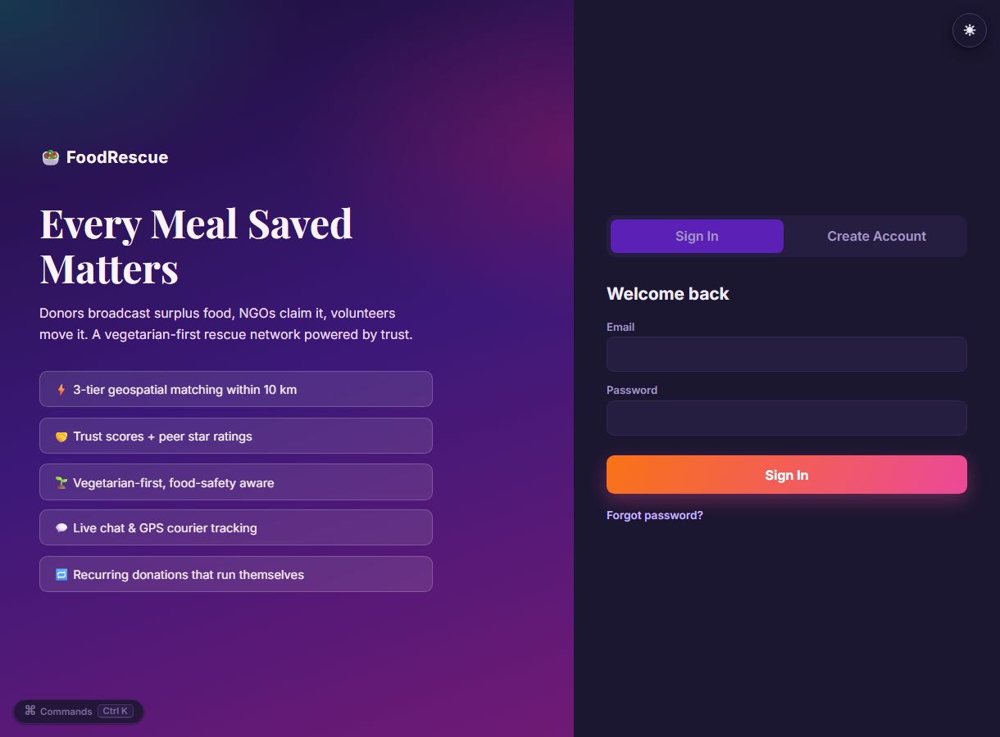
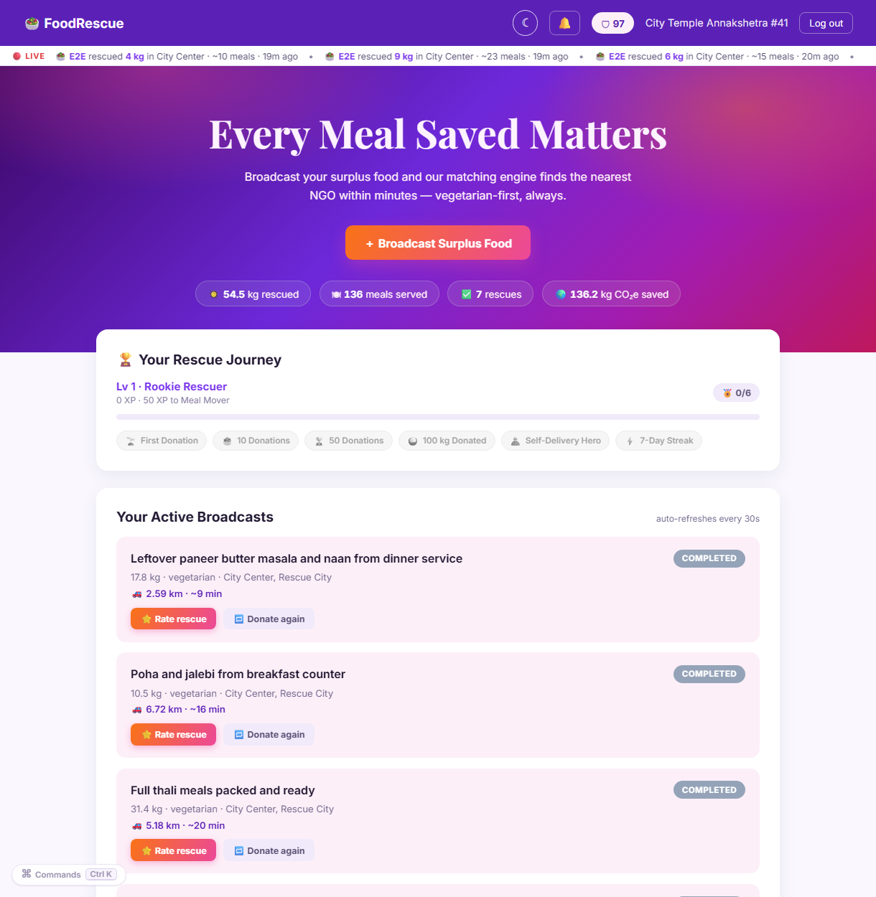
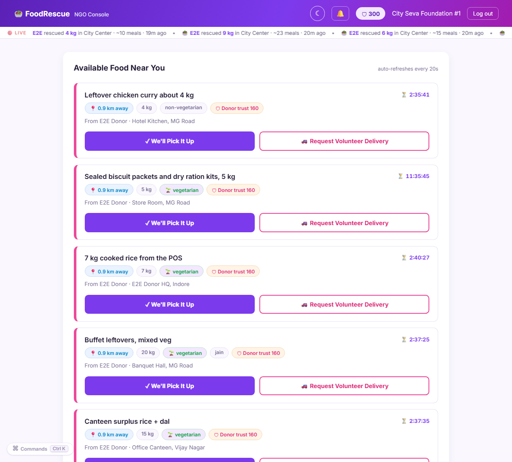
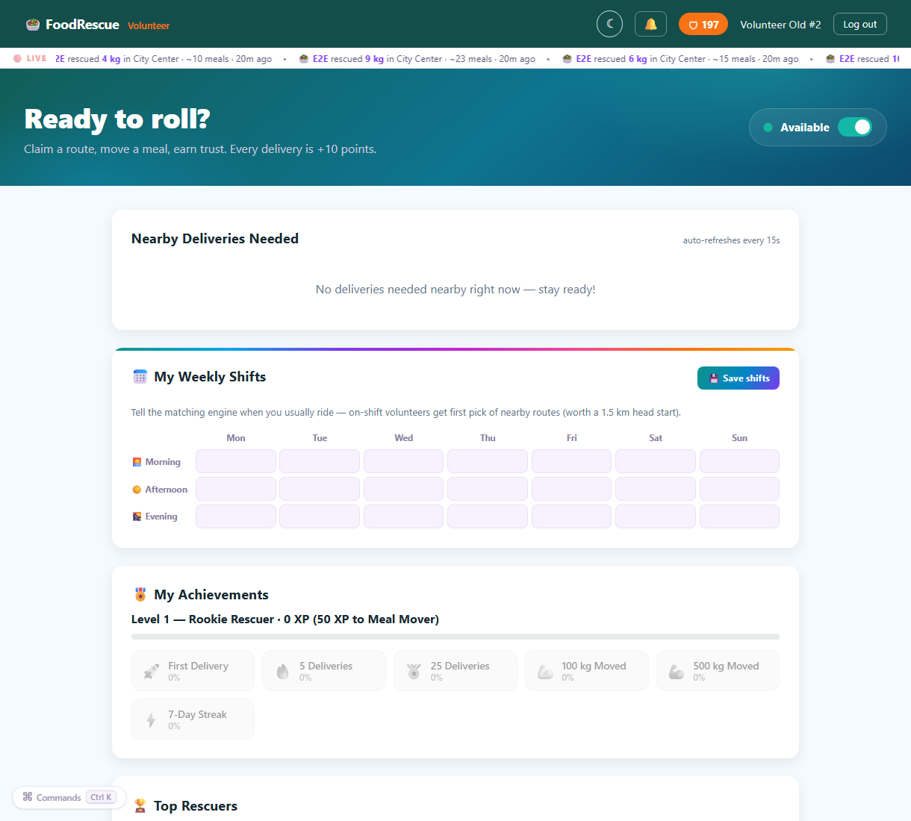
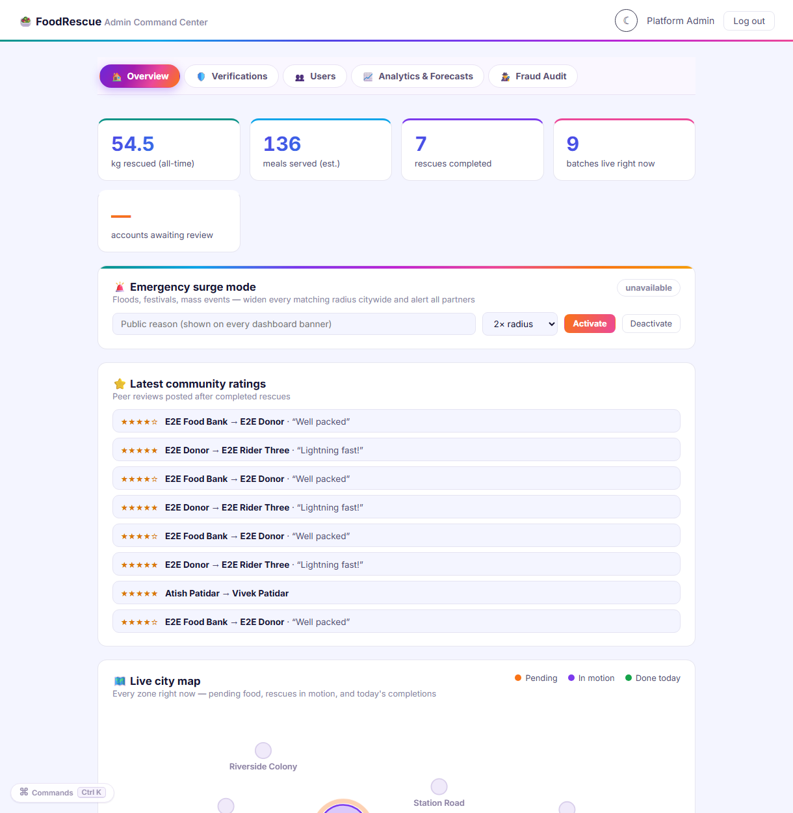
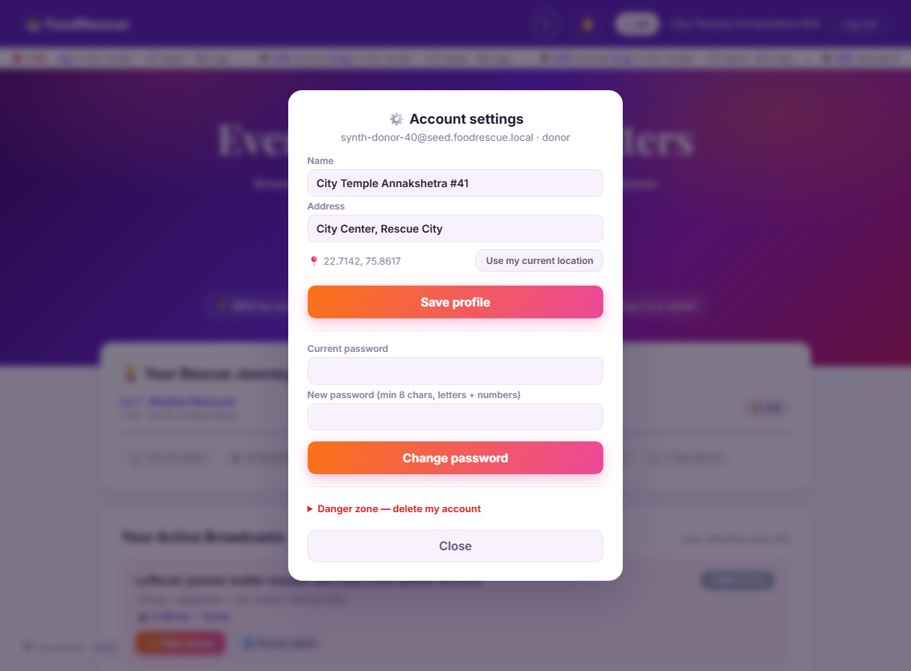

# 🥗 FoodRescue — AI-Driven Food Rescue Platform

FoodRescue connects **donors** with surplus food to **NGOs** that can use it,
with **volunteers** bridging the delivery gap. A 3-tier geospatial matching
engine finds the nearest receiver within minutes, a trust-score system keeps
every actor accountable, and the whole platform is **vegetarian-first**.

Beyond matching, the platform ships a full operational layer: **signup email
verification** (a 6-digit OTP proves the inbox is really yours before the
account exists), **KYC account verification** (every donor / NGO / volunteer
is reviewed by an admin team before they can act), a **dedicated admin
command center with separate credentials**, **forgot-password with emailed
reset codes (Brevo API)**,
**per-rescue chat**, **live GPS courier tracking**, **peer star ratings**,
**recurring donation schedules**, **food-safety windows** (the 4-hour rule,
enforced), **volunteer shifts**, **NGO watch zones**, a **referral program**,
**emergency surge mode**, **personal impact reports with CSV export**, a
**live city-wide rescue ticker**, **XP levels + badge walls**, a **spotlight
onboarding tour**, four **selectable accent themes**, an **installable
PWA**, and full **account self-service** (profile + location editing,
logged-in password change with session revocation, broadcast cancellation,
password-confirmed account deletion) — all on a vibrant multi-hue design
system with full dark mode.

## Screenshots

| | |
| --- | --- |
|  *Sign-in & registration — dark mode* |  *Donor dashboard — live ticker, impact, badges, broadcasts* |
|  *NGO console — nearby food sorted by distance* |  *Volunteer app — routes, weekly shifts, achievements* |
|  *Admin command center — surge mode, ratings, live city map* |  *Account settings — profile, password, danger zone* |

| Layer     | Technology                                                     |
| --------- | -------------------------------------------------------------- |
| Backend   | Python 3.11+, Flask, flask-cors, PyMongo, python-dotenv, PyJWT |
| Database  | MongoDB Atlas (2dsphere geospatial indexes)                    |
| Frontend  | Vanilla HTML5 / CSS3 / ES6+ JavaScript — zero frameworks       |
| Routing   | Google Maps Distance Matrix API (Haversine fallback)           |

---

## Project Structure

```
food-rescue/
├── backend/
│   ├── app.py               # Flask app factory + background scheduler
│   ├── db.py                # Mongo connection, indexes, schemas, helpers
│   ├── auth.py              # register / login / JWT middleware / forgot-password
│   │                        #   (Brevo) / admin bootstrap / verification gate
│   │                        #   / account settings (profile, password, delete)
│   ├── verification.py      # 🛡 KYC rules: role-specific details + ID documents
│   ├── donor_routes.py      # broadcast, cancel, my-batches, self-deliver,
│   │                        #   templates, donate-again, recurring schedules
│   ├── ngo_routes.py        # available, accept (atomic), request-volunteer,
│   │                        #   cancel, watch zones
│   ├── volunteer_routes.py  # available, claim (atomic), complete, cancel,
│   │                        #   weekly availability shifts
│   ├── social_routes.py     # 💬 per-batch chat, ⭐ ratings, 📡 live GPS tracking
│   ├── admin_routes.py      # 🛠 user management, suspensions, surge mode
│   ├── engine.py            # 3-tier matching engine (+ shift boost, surge radius,
│   │                        #   watch-zone alerts)
│   ├── logistics.py         # Google Maps Distance Matrix + Haversine fallback
│   ├── media_routes.py      # proof-of-delivery photo storage + access control
│   ├── stats_routes.py      # public impact metrics + leaderboard + surge flag
│   │                        #   + personal impact report (JSON/CSV)
│   ├── zones.py             # 🧠 shared city-zone grid (DS layer)
│   ├── seed_data.py         # 🧠 historical data simulator (10k records / 2 yrs)
│   ├── nlp_engine.py        # 🧠 spaCy food categorization (veg-first)
│   ├── time_series.py       # 🧠 Holt-Winters forecasting + prediction intervals + backtesting
│   ├── fraud_detection.py   # 🧠 IsolationForest + physics-rules audit + z-score explainability
│   ├── analytics.py         # 🧠 weekday × hour demand-pattern surface
│   ├── ds_routes.py         # 🧠 /api/predict-surplus, /api/forecast-accuracy, /api/demand-patterns, /api/run-audit, /api/parse-food
│   ├── sms.py               # 📲 opt-in SMS alerts via Brevo transactional SMS
│   ├── integrations.py      # 🤖 POS API keys + machine-to-machine broadcast
│   ├── esg.py               # 🌍 ESG carbon model + certified audit reports
│   ├── e2e_test.py          # 209-check end-to-end regression suite
│   └── requirements.txt
├── frontend/
│   ├── theme.css               # 🎨 "Festival" design tokens (violet→pink→orange)
│   │                           #    + dark mode + all shared fr-ui component styles
│   ├── theme.js                # 🎨 persisted light/dark controller (no-flash)
│   ├── fr-ui.js                # ⚡ shared UI engine: toasts, Ctrl+K command palette,
│   │                           #    chat dock, rating modal, tracking bars, confetti,
│   │                           #    surge banner, desktop alerts, PWA install
│   ├── sw.js                   # 📱 service worker — offline app shell
│   ├── manifest.webmanifest    # 📱 installable-PWA manifest (+ icon.svg)
│   ├── auth.html/.css/.js       # shared login / register (+ referral code)
│   ├── donor.html/.css/.js      # donor dashboard (sunset identity)
│   ├── ngo.html/.css/.js        # NGO console (violet-fuchsia identity)
│   ├── volunteer.html/.css/.js  # volunteer app (teal-cyan identity)
│   └── admin.html/.css/.js      # 📊 ops command center (charts + user mgmt + surge)
├── .env.example
└── README.md
```

---

## Setup

> Deploying to a real server? See **[docs/DEPLOYMENT.md](docs/DEPLOYMENT.md)**
> — a full production guide mapped to the GitHub Student Developer Pack
> (DigitalOcean + MongoDB Atlas + free domain + HTTPS).

### 1. Clone & install

```bash
git clone <your-repo-url> food-rescue
cd food-rescue/backend
python -m venv .venv
# Windows: .venv\Scripts\activate    macOS/Linux: source .venv/bin/activate
pip install -r requirements.txt
```

### 2. Configure environment

```bash
cp ../.env.example ../.env    # then edit .env
```

| Variable              | Purpose                                                        |
| --------------------- | -------------------------------------------------------------- |
| `MONGO_URI`           | MongoDB Atlas connection string (`.../food_rescue`)            |
| `JWT_SECRET`          | Secret for signing JWTs — set a long random string             |
| `GOOGLE_MAPS_API_KEY` | Distance Matrix API key (optional — Haversine fallback kicks in) |
| `CORS_ORIGINS`        | Comma-separated allowed origins (no wildcards)                 |
| `FLASK_ENV`           | `development` enables debug mode                               |
| `ADMIN_EMAIL` / `ADMIN_PASSWORD` | Dedicated admin account, bootstrapped at startup — sign in on `admin.html` |
| `BREVO_API_KEY`       | Brevo transactional-email key for password-reset codes (without it, dev mode returns the code in the response) |
| `SENDER_EMAIL` / `SENDER_NAME` | From-address for reset emails                         |

### 3. Run the API

```bash
python app.py           # serves http://localhost:5000
```

Indexes are created automatically on startup. The 5-minute background
scheduler (pickup-window enforcement + batch expiry) starts with the app.

### 4. Serve the frontend

Any static server works — the CORS default expects port 5500:

```bash
cd ../frontend
python -m http.server 5500
# open http://localhost:5500/auth.html
```

---

## MongoDB Atlas Index Setup

Created automatically by `db.initialize()`, or run manually in `mongosh`:

```javascript
db.users.createIndex({ location: "2dsphere" })
db.food_batches.createIndex({ pickup_location: "2dsphere" })
db.food_batches.createIndex({ status: 1, created_at: -1 })
db.users.createIndex({ email: 1 }, { unique: true })
```

> **GeoJSON strictness:** every coordinate is stored as
> `{"type": "Point", "coordinates": [longitude, latitude]}` — **longitude
> first**. Any other shape breaks 2dsphere indexing.

---

## API Reference

| Method | Path                                | Auth        | Description |
| ------ | ----------------------------------- | ----------- | ----------- |
| GET    | `/health`                           | —           | Liveness check |
| POST   | `/auth/email-otp`                   | —           | 🆕 Send a 6-digit signup code to an email address (Brevo; dev fallback returns it) |
| POST   | `/auth/verify-email-otp`            | —           | 🆕 Exchange the code for a short-lived `email_token` (15-min code, 5 attempts) |
| POST   | `/auth/register`                    | —           | Create account (requires the OTP-verified `email_token` for the address) |
| POST   | `/auth/login`                       | —           | Returns JWT + profile |
| GET    | `/auth/me`                          | any role    | Current user profile (no password hash) |
| GET    | `/auth/notifications`               | any role    | Latest 20 notifications |
| POST   | `/auth/notifications/read`          | any role    | Mark all notifications read |
| POST   | `/auth/profile`                     | any role    | 🆕 Update name / address / location (NGOs: dietary flag too) |
| POST   | `/auth/change-password`             | any role    | 🆕 Rotate password while signed in (current + new password) |
| POST   | `/auth/delete-account`              | any role    | 🆕 Permanently delete the account (password-confirmed; blocked while a rescue is active) |
| POST   | `/donor/broadcast`                  | donor       | Create batch, triggers matching engine (background thread) |
| POST   | `/donor/cancel/<batch_id>`          | donor       | 🆕 Retract an own still-pending broadcast (no penalty) |
| GET    | `/donor/my-batches`                 | donor       | Donor's batches, newest first |
| POST   | `/donor/self-deliver/<batch_id>`    | donor       | Opt into self-delivery (+50 trust), attaches route info |
| POST   | `/donor/complete/<batch_id>`        | donor       | Confirm self-delivery arrived, records Match |
| GET    | `/ngo/available-batches`            | ngo         | Pending batches by proximity (`$geoNear`), veg-compatible |
| GET    | `/ngo/active-batch`                 | ngo         | NGO's current batch, if any |
| GET    | `/ngo/trust-history`                | ngo         | Last 20 trust-score events |
| POST   | `/ngo/accept/<batch_id>`            | ngo         | **Atomic** claim — 409 if already taken |
| POST   | `/ngo/request-volunteer/<batch_id>` | ngo         | Flip to `volunteer_needed`, re-run matching |
| POST   | `/ngo/confirm-pickup/<batch_id>`    | ngo         | Complete a self-pickup, records Match |
| POST   | `/ngo/cancel/<batch_id>`            | ngo         | Release batch (−15 trust), returns to pool |
| GET    | `/volunteer/available-batches`      | volunteer   | `volunteer_needed` routes by proximity |
| GET    | `/volunteer/active-batch`           | volunteer   | Current in-transit delivery, if any |
| POST   | `/volunteer/claim/<batch_id>`       | volunteer   | **Atomic** claim — 409 if already claimed |
| POST   | `/volunteer/complete/<batch_id>`    | volunteer   | Mark delivered — **requires `proof_photo` data URI** (+10 trust), records Match |
| POST   | `/volunteer/cancel/<batch_id>`      | volunteer   | Back out (−15 trust), route reopens |
| GET    | `/media/proof/<batch_id>`           | batch party | Proof-of-delivery photo (donor / NGO / volunteer only) |
| GET    | `/donor/templates`                  | donor       | 🆕 Saved broadcast templates |
| POST   | `/donor/templates`                  | donor       | 🆕 Save a broadcast preset (max 12) |
| POST   | `/donor/templates/<id>/donate`      | donor       | 🆕 One-click broadcast from a template |
| DELETE | `/donor/templates/<id>`             | donor       | 🆕 Delete a template |
| POST   | `/donor/rebroadcast/<batch_id>`     | donor       | 🆕 "Donate again" — clone a past batch as a new broadcast |
| GET/POST | `/donor/recurring`                | donor       | 🆕 List / create weekly recurring donation schedules (max 8) |
| POST   | `/donor/recurring/<id>/toggle`      | donor       | 🆕 Pause / resume a schedule |
| POST   | `/donor/recurring/<id>/run-now`     | donor       | 🆕 Fire a schedule immediately |
| DELETE | `/donor/recurring/<id>`             | donor       | 🆕 Delete a schedule |
| GET/POST | `/ngo/watch-zones`                | ngo         | 🆕 Subscribe to city zones for out-of-radius batch alerts |
| GET/POST | `/volunteer/availability`         | volunteer   | 🆕 Weekly shift grid (boosts matching rank when on-shift) |
| GET/POST | `/social/chat/<batch_id>`         | batch party | 🆕 Per-rescue coordination thread (`?after=` incremental polling) |
| POST   | `/social/rate/<batch_id>`           | batch party | 🆕 1–5⭐ peer review of a completed rescue (one per ratee) |
| GET    | `/social/ratings/me`                | any role    | 🆕 My reputation: average, recent reviews, rated batches |
| POST   | `/social/track/<batch_id>`          | courier     | 🆕 GPS ping while in transit (breadcrumb capped at 60 points) |
| GET    | `/social/track/<batch_id>`          | batch party | 🆕 Courier position, % progress, km remaining, ETA |
| GET    | `/auth/referral`                    | any role    | 🆕 My referral code + invite stats |
| POST   | `/auth/forgot-password`             | —           | 🆕 Email a 6-digit reset code (Brevo API; generic reply — no account probing) |
| POST   | `/auth/reset-password`              | —           | 🆕 Set a new password with the emailed code (15-min expiry, 5 attempts, single-use) |
| GET    | `/auth/verification`                | any role    | 🆕 My KYC status + submitted details |
| POST   | `/auth/verification`                | any role    | 🆕 Resubmit verification details after a rejection |
| GET    | `/admin/verifications?status=`      | admin       | 🆕 KYC review queue (pending / rejected / approved, FIFO) |
| GET    | `/admin/verifications/<id>/document`| admin       | 🆕 Applicant's uploaded ID document |
| POST   | `/admin/verifications/<id>/approve` | admin       | 🆕 Approve an account (notifies the user) |
| POST   | `/admin/verifications/<id>/reject`  | admin       | 🆕 Reject with a mandatory reason (user can resubmit) |
| GET    | `/stats/activity`                   | —           | 🆕 Public live-rescue ticker feed (first names only) |
| GET    | `/stats/zones-live`                 | —           | 🆕 Live per-zone batch counts (powers the admin city map) |
| GET/POST | `/auth/preferences`               | any role    | 🆕 Notification prefs — opt in to SMS alerts (Brevo SMS API) |
| POST   | `/ngo/cold-storage`                 | ngo         | 🆕 Declare cold-storage capability (unlocks ❄ cold-chain batches) |
| GET    | `/volunteer/route-addons`           | volunteer   | 🆕 Multi-stop suggestions: a 2nd rescue on the current route |
| GET/POST/DELETE | `/integrations/api-key`      | donor       | 🆕 Per-donor POS API key (hashed at rest, shown once) |
| POST   | `/integrations/pos/broadcast`       | X-API-Key   | 🆕 Machine-to-machine broadcast — a POS/inventory system donates surplus at closing time |
| GET    | `/esg/dashboard`                    | donor       | 🌍 Corporate ESG dashboard: lifetime CO₂e/methane avoided, equivalents, 12-month series |
| GET    | `/esg/report.csv`                   | donor       | 🌍 Certified ESG audit report (monthly contributions + methodology) |
| GET    | `/esg/preview?kg=`                  | any role    | 🌍 Live carbon-equivalence math for a given weight |
| GET    | `/stats/surge`                      | —           | 🆕 Public surge-mode flag (powers the dashboard banner) |
| GET    | `/stats/my-impact`                  | any role    | 🆕 Personal impact report: totals, 12-week series, streak |
| GET    | `/stats/my-impact.csv`              | any role    | 🆕 CSV export of every completed rescue (CSR / grant reports) |
| GET    | `/admin/overview`                   | admin*      | 🆕 Platform snapshot: users, batches by status, ratings |
| GET    | `/admin/users?q=&role=`             | admin*      | 🆕 Search / browse accounts |
| POST   | `/admin/users/<id>/suspend`         | admin*      | 🆕 Suspend / reinstate an account (blocks login + live tokens) |
| POST   | `/admin/users/<id>/trust`           | admin*      | 🆕 Manual trust correction (±100, audited reason required) |
| GET/POST | `/admin/surge`                    | admin*      | 🆕 Toggle emergency surge mode (widens every matching radius) |
| GET    | `/stats/impact`                     | —           | Public aggregate impact metrics (kg, meals, CO₂e) — real rescues only |
| GET    | `/stats/leaderboard`                | —           | Top volunteers (trust + ⭐ rating) and donors (kg donated) |
| GET    | `/api/predict-surplus`              | any role    | 🧠 7-day per-zone surplus forecast **with 80% prediction intervals** + volunteer pre-positioning (`?refresh=1` retrains) |
| GET    | `/api/forecast-accuracy`            | any role    | 🧠 Walk-forward backtest of the forecaster — WAPE/MAE/RMSE, skill vs. baseline, zone-ranking ρ |
| GET    | `/api/demand-patterns`              | any role    | 🧠 Weekday × hour surplus demand surface (heatmap data) |
| GET/POST | `/api/run-audit`                  | any role*   | 🧠 IsolationForest + physics-rules fraud audit **with per-feature z-score explainability** (*admin-gated via `ADMIN_EMAILS`) |
| POST   | `/api/parse-food`                   | any role    | 🧠 Preview NLP extraction for a raw food description |

**Race-condition safety:** every claim uses PyMongo `find_one_and_update`
with a status filter (`{"status": "pending"}` / `{"status":
"volunteer_needed"}`), so exactly one claimant wins; losers get `409`.

---

## Account Verification (KYC) 🛡

Nobody acts on the platform until a human has checked they're genuine:

1. **Sign-up collects role-specific proof** — donors submit their FSSAI /
   shop-licence / government ID (households are exempt from the licence),
   NGOs their registration number + optional NGO Darpan ID, volunteers their
   driving licence + vehicle type. Everyone adds a contact phone and can
   attach an ID-document photo (client-side compressed, magic-byte validated,
   stored in MongoDB like proof photos).
2. **The account starts `pending`** — the dashboard shows a review screen
   (auto-polling every 30 s), and every action endpoint answers
   `403 {"code": "not_verified"}`. The matching engine never routes food to
   unverified or suspended partners.
3. **Admins review the FIFO queue** in the command center: all submitted
   details, the ID document viewer, one-click **Approve** (user is notified +
   unlocked live) or **Reject with a reason**.
4. **Rejected users resubmit** corrected details right from the lock screen
   and return to the queue.

Accounts created before this feature are grandfathered as approved — no
migration needed.

## Admin Command Center 🔐

`admin.html` is now gated behind a **dedicated administrator sign-in** — the
admin account is bootstrapped at startup from `ADMIN_EMAIL`/`ADMIN_PASSWORD`
(role `admin`, cannot be suspended, exempt from KYC). The single console
merges everything: platform tiles, the **verification queue**, surge control,
user management (search / suspend / audited trust edits), community ratings,
and the full analytics + forecasting + fraud-audit suite.

## Forgot Password ✉️

`POST /auth/forgot-password` issues a salted-hashed 6-digit code (15-minute
expiry, 5 wrong-attempt cap, single-use) and emails it through the **Brevo
transactional-email API**. The endpoint always answers with the same generic
message so it can't be used to probe which emails exist. Without a
`BREVO_API_KEY` (local dev) the code is returned in the response as
`dev_code` so the flow stays fully testable.

## ESG Carbon Monetization 🌍

Corporate donors don't just feed people — they earn **auditable carbon
offsets**, computed by a documented scientific model (`esg.py`):

- **Landfill pathway** — food waste decomposing anaerobically releases
  methane: `0.025 kg CH₄/kg` (IPCC first-order-decay, low-capture sites)
  × GWP-100 of `28` = **0.70 kg CO₂e per kg** avoided.
- **Avoided production** — a rescued meal replaces one that would have been
  grown, processed and cooked: **1.80 kg CO₂e per kg** (vegetarian mix,
  Poore & Nemecek 2018, *Science*).
- **Total: 2.50 kg CO₂e per kg rescued** — consistent with the platform's
  public impact stats, with every constant in one auditable file.

The donor dashboard's **Sustainability panel** renders lifetime CO₂e and
methane totals, human-scale equivalents (car-days off the road, tree-years,
km not driven, phone charges — US EPA factors), and a 12-month contribution
bar series — all fetched asynchronously from a single MongoDB aggregation.
One click downloads the **certified ESG audit report** (CSV with monthly
breakdown, lifetime totals and full methodology) or prints the **formal
report** for CSR filings, tax paperwork and PR. Only real, proof-backed
completed rescues ever enter a report.

## Trust Score System

Everyone starts at **100**.

| Event                                             | Delta |
| ------------------------------------------------- | ----- |
| Donor self-delivers after no volunteer found      | **+50** (5× multiplier event) |
| Volunteer completes a delivery                    | **+10** |
| Referred user completes their first rescue        | **+10 to both** referrer and referee |
| NGO/volunteer cancels after accepting             | **−15** |
| NGO misses pickup window (>2 hours after accept)  | **−20** (auto-enforced every 5 min) |
| Admin manual correction (audited reason required) | ±100 max |

Trust is complemented by **⭐ peer ratings**: after a completed rescue every
party can leave a 1–5 star review of the others. Averages are mirrored onto
the user document (`rating_sum`/`rating_count`) so leaderboards and the admin
console read them without re-aggregating.

---

## 3-Tier Matching Flow

```
                         ┌─────────────────────────────┐
                         │  Donor broadcasts batch     │
                         │  status: pending            │
                         │  expires_at: now + 3h       │
                         └──────────────┬──────────────┘
                                        │  engine.run_matching (bg thread)
                                        ▼
          ┌─────────────────────────────────────────────────────┐
 TIER 1   │  $near NGOs within 10 km (vegetarian-compatible)    │
 t = 0    │  → notify top 3 NGOs                                │
          └──────────────┬───────────────────────┬──────────────┘
                         │ NGO accepts (ATOMIC)  │ no acceptance
                         ▼                       │
          ┌──────────────────────────┐           │
          │ status: ngo_pickup       │           │
          │ (2h pickup window)       │           │
          └──────┬─────────┬─────────┘           │
   NGO picks up  │         │ NGO requests        │
                 ▼         ▼ volunteer           ▼
          ┌───────────┐  ┌────────────────────────────────────┐
          │ completed │  │ status: volunteer_needed           │
          └───────────┘  │ $near volunteers within 10 km      │
 TIER 2                  │ → notify top 5 volunteers          │
 t = 30 min              └───────┬──────────────┬─────────────┘
                    volunteer    │              │ none claims
                    claims       ▼              ▼
                 ┌──────────────────┐   ┌───────────────────────┐
                 │ status: in_transit│  │ Donor prompt:         │
                 │ → completed (+10) │  │ self-deliver? (+50)   │
                 └──────────────────┘   └──────────┬────────────┘
                                                   │ declined
 TIER 3 (FALLBACK)                                 ▼
 t = 60 min       ┌────────────────────────────────────────────┐
                  │ Expand $near to 25 km                      │
                  │ + secondary partners (animal shelters)     │
                  └──────────────────┬─────────────────────────┘
                                     │ still unmatched
 t = 90 min                          ▼
                  ┌────────────────────────────────────────────┐
                  │ status: expired → donor notified           │
                  └────────────────────────────────────────────┘
```

Escalation timers use `threading.Timer` (scheduled checks — never
`time.sleep`), and a 5-minute sweep acts as a restart-safe safety net for
expiry and pickup-window enforcement.

---

## Proof of Delivery 📸

Volunteers cannot complete a delivery without uploading a photo taken at the
drop-off point. The photo is:

1. captured/compressed client-side (≤1280 px JPEG via canvas),
2. validated server-side — strict data-URI grammar, base64 decode check,
   **magic-byte verification** (payload must really be JPEG/PNG/WebP),
   4 MB size cap,
3. stored inside MongoDB (`delivery_proofs`, one per batch — no filesystem,
   no path traversal, no orphan files),
4. viewable only by the three parties of that batch (donor, receiving NGO,
   volunteer) via `GET /media/proof/<batch_id>` — everyone else gets 403.

An invalid photo leaves the delivery `in_transit` so the volunteer can retry.

## Security Hardening

- **Rate limiting** — sliding-window limiter on `/auth/login` (10/min/IP) and
  `/auth/register` (12/min/IP) returns 429 on brute force. In-memory; swap
  for a Redis-backed limiter when scaling past one process.
- **NoSQL-injection guards** — all auth fields are type-checked strings, so
  payloads like `{"email": {"$gt": ""}}` die with 401, never touch a query.
- **Password policy** — minimum 8 characters, werkzeug salted hashes.
- **JWT** — signed HS256, 72 h expiry, secret from `.env` (ephemeral random
  fallback in dev; never hardcoded).
- **Upload safety** — 8 MB request cap (413 beyond), image magic-byte checks.
- **Security headers** — `X-Content-Type-Options: nosniff`,
  `X-Frame-Options: DENY`, `Referrer-Policy: no-referrer`, `Cache-Control:
  no-store` on every response.
- **CORS** — explicit origin allowlist from `.env`, never `*`.
- **Trust floor** — scores can't go below 0; startup index builds survive
  legacy duplicate data instead of crashing the API.

## Advanced Features

### The operational layer (12+ pro features)

1. **💬 Per-rescue chat** — a private thread per batch between the donor, the
   receiving NGO and the volunteer. Access-controlled server-side (403 for
   everyone else), incremental `?after=` polling keeps the 5-second refresh
   payload tiny, and new messages ping the other parties' notification bells.
2. **📡 Live GPS courier tracking** — the volunteer's browser shares position
   every 20 s while in transit; donor and NGO watch an animated progress bar
   with % of the delivery leg covered, km remaining and a conservative ETA.
   Breadcrumb trail capped at 60 points so documents never balloon.
3. **⭐ Peer ratings & reviews** — post-completion 1–5 star reviews with
   comments, unique per (batch, rater, ratee) via a unique index, aggregated
   onto profiles, the leaderboard and the admin console.
4. **🔁 Recurring donation schedules** — "every Mon/Wed/Fri at 21:30, 15 kg of
   canteen surplus." Timezone-aware `next_run_at` computation; the 5-minute
   background sweep broadcasts due schedules automatically. Pause/resume,
   run-now, and a hard cap of 8 per donor.
5. **⚡ Batch templates + donate-again** — save a broadcast as a named preset
   and re-donate in one click; any past batch can be cloned as a fresh
   broadcast.
6. **🥘 Food-safety windows (4-hour rule)** — donors declare how long ago food
   was cooked; the platform computes a hard `safe_until` stop, tightens the
   batch expiry to it, renders live freshness badges (fresh / expiring /
   critical), rejects broadcasts that can't be served safely, and refuses NGO
   acceptance of food past its window.
7. **📅 Volunteer availability shifts** — a 7-day × 3-period grid. On-shift
   volunteers get a 1.5 km ranking head start in the matching engine
   (timezone-aware, stored per user).
8. **👁 NGO watch zones** — subscribe to any of the 8 city zones and get
   notified of *every* new compatible batch there, regardless of distance —
   a food bank can monitor the wholesale market across town.
9. **🎁 Referral program** — every account gets a 6-char code (unambiguous
   alphabet, unique index). When a referred user completes their first rescue,
   referrer *and* referee both earn +10 trust — awarded atomically, exactly
   once.
10. **🚨 Emergency surge mode** — floods, festivals, mass events: an admin
    flips one switch and every matching/discovery radius widens (default 2×,
    up to 5×), partners are notified, and a live banner appears on every
    dashboard via the public `/stats/surge` flag.
11. **🛠 Admin console** — user search, suspension (blocks login *and* live
    tokens), audited manual trust corrections, surge control, and a live
    community-ratings feed — gated by `ADMIN_EMAILS`, admins can't be locked
    out.
12. **📈 Personal impact reports + CSV export** — lifetime totals, a 12-week
    weekly sparkline, live streak and top zone per user, plus a one-click CSV
    of every completed rescue for CSR/grant paperwork.
13. **📱 Installable PWA** — web manifest + service worker with a cache-first
    offline app shell (API data stays live), install prompt via the command
    palette.
14. **⌨️ Command palette + desktop alerts + celebration layer** — Ctrl+K
    fuzzy-searchable commands on every panel (navigate, toggle theme, copy
    referral code, export CSV, install app, log out…), opt-in browser
    notifications for new rescue alerts, stacked toasts, and a confetti burst
    on every completed rescue.
15. **🔴 Live rescue ticker** — a scrolling marquee under every dashboard nav
    showing the city's latest completed rescues ("Ravi rescued 12 kg in Old
    Town Bazaar · ~30 meals · 2h ago"), from the public anonymized
    `/stats/activity` feed. Pauses on hover, refreshes every 2 minutes.
16. **🏆 XP levels + badge walls on every dashboard** — the gamification
    engine (10 XP per rescue + 1 XP per kg, six levels from Rookie Rescuer to
    Guardian of the City, per-role badge sets) now renders on the donor and
    NGO panels too: level, XP progress bar and an earn-as-you-go badge wall.
17. **🧭 Spotlight onboarding tour** — first visit to any dashboard starts a
    step-by-step spotlight walkthrough of the key panels (skippable, arrow-key
    navigable, replayable from the command palette).
18. **🎨 Accent theme packs** — beyond light/dark, pick Festival (default),
    Ocean, Forest or Sunrise from the command palette; the whole token layer
    re-hues instantly and the choice persists (no-flash restore on load).
19. **🪪 QR handoff cards** — the donor's 6-digit pickup OTP (already enforced
    server-side on every completion path with constant-time comparison)
    renders as a printable handoff card with a scannable QR code; the digits
    always work offline.
20. **❄ Cold-chain support** — dairy/refrigeration-dependent food is
    auto-detected by the NLP layer (paneer, curd, kheer…) or flagged by the
    donor; the window tightens to 2 hours and the batch only matches, routes
    and displays to NGOs that declared cold storage.
21. **🧭 Multi-stop volunteer trips** — a courier carrying one batch sees
    "on your way" suggestions (pickup ≤3 km, drop-off ≤3 km or same NGO) and
    can add ONE more rescue to the trip; each leg completes with its own OTP
    + proof photo.
22. **📲 SMS alerts (Brevo SMS API)** — opt-in texts (same `BREVO_API_KEY`)
    for the moments a browser tab can't cover: new rescues nearby, routes
    available, and verification decisions. Uses the KYC-verified phone
    number; single-segment messages; dev fallback logs instead of sending.
23. **🤖 POS auto-broadcast** — restaurants connect their billing/inventory
    system with a per-donor API key (hashed at rest, shown exactly once,
    revocable) and `POST /integrations/pos/broadcast` at closing time;
    address and location default to the registered profile.
24. **🎓 Printable impact certificates** — a one-click, print-ready CSR
    certificate of contribution (rescues, kg, meals, CO₂e) generated from
    verified completed rescues.
25. **🗺️ Live city map** — the admin command center plots all 8 zones as a
    pulsing SVG map: pending food, rescues in motion and today's completions
    per zone, refreshed every minute.

### Matching & platform

- **Trust-weighted matching** — candidates are ranked by
  `distance_km − (trust − 100) × 0.05 − (1.5 if on shift)`, so a reliable
  partner 1 km farther beats a flaky one next door (20 trust points ≈ 1 km
  advantage), and volunteers who told us they're free right now win ties.
- **Notification bell** — live unread badge + dropdown on all dashboards,
  backed by the engine's deduplicated notifications collection.
- **Impact dashboard** — kg rescued, meals served, CO₂e avoided and rescue
  counts on the donor hero, from a public aggregate endpoint.
- **Leaderboard** — top rescuers by trust, deliveries and ⭐ rating.
- **Two-leg volunteer ETAs** — route info covers volunteer → pickup → NGO.
- **🎨 "Festival" design system + dark mode** — a shared `theme.css` token
  layer drives a vibrant multi-hue identity (violet → fuchsia → coral
  gradients with teal/sky/lime/gold accent pops) plus per-role palettes:
  donor = sunset orange-pink, NGO = violet-fuchsia, volunteer = teal-cyan,
  admin = indigo. `theme.js` provides the persisted no-flash light/dark
  toggle; `fr-ui.js` ships every shared component (toasts, palette, chat
  dock, rating modal, progress bars, chips, availability grid, surge banner)
  styled against the same tokens in both themes.
- **Ops Analytics command center** (`admin.html`) — hand-rolled, dependency-free
  SVG charts following a validated, colorblind-safe dataviz palette: a 30-day
  rescue trend, per-zone forecast bars, a **citywide forecast with its 80%
  prediction band**, a **model-accuracy scorecard + predicted-vs-actual
  overlay**, a **weekday × hour demand heatmap**, and the **fraud audit with
  per-feature explainability bars** — all theme-aware.

## Data Science Layer 🧠

Four modular ML components live in their own files and plug into the same
Flask app (`ds_routes.py` blueprint, prefix `/api`). Install once:

```bash
pip install pandas scikit-learn statsmodels spacy
python -m spacy download en_core_web_sm
```

### 1. Historical Data Simulator — `seed_data.py`

Generates 2 years of synthetic vegetarian-first rescue history (default
**10,000 broadcasts**, ~115 synthetic users) directly into MongoDB so the
models have training data. pandas builds a per-day/per-zone intensity model
(weekday × wedding-season × monsoon × festival × weather effects) and numpy
samples exact record counts from it. Includes 3 planted fraud accounts as
audit ground truth.

```bash
cd backend
python seed_data.py            # abort-safe if already seeded
python seed_data.py --reset    # wipe synthetic docs and reseed
```

Every synthetic document carries `is_synthetic: true` — the matching engine
never notifies synthetic users and public stats exclude them entirely.

### 2. NLP Food Categorization — `nlp_engine.py`

`POST /donor/broadcast` now accepts a raw sentence. spaCy (`en_core_web_sm`)
plus a vegetarian-first domain lexicon extracts:

```
"We have 15 kg of cooked paneer left over"
  → food_type: Vegetarian, quantity_kg: 15.0, perishable: true,
    dietary_tags: ["vegetarian"], food_items: ["paneer"]
```

- `quantity_kg` becomes optional — parsed from text (kg/plates/boxes/servings,
  written numbers like "fifty plates" included).
- **Dietary safety override**: an explicit meat/egg term in the description
  always beats a "vegetarian" claim (`nlp.dietary_override: true` on the
  batch); faux-meat ("soya chicken", "mock meat") is guarded and stays veg.
- Unknown perishability defaults to `true` — the food-safe assumption.

### 3. Predictive Supply Forecasting — `time_series.py`

`GET /api/predict-surplus` trains one **Holt-Winters** model per city zone
(statsmodels `ExponentialSmoothing`, weekly seasonality, 240-day window) on
daily surplus kg and returns a 7-day forecast: per-zone daily kg, peak day,
rank, and a proportional volunteer pre-positioning split (`DS_FLEET_SIZE`,
default 20). Zones with thin history fall back to a seasonal-naive model.
Results are cached 6 h; `?refresh=1` retrains. (Prophet was skipped
deliberately: no Stan wheels for Python 3.14 on Windows — Holt-Winters covers
level + trend + weekly seasonality, which a 7-day horizon needs.)

Three things make this production-grade rather than a bare `.forecast()` call:

- **Prediction intervals.** Every zone/day forecast carries an 80% interval
  (`lower_kg`/`upper_kg`) from the model's in-sample residual spread, widened
  by `sqrt(step)` with the horizon. The citywide band combines zone variances
  (independence assumption) instead of stacking bounds, so it is correctly
  tighter. A point estimate with no band is a guess dressed as a fact.
- **Ragged-edge trimming.** The most recent day(s) of history are always
  incomplete (batches still open, deliveries unconfirmed); `effective_index`
  trims trailing days whose citywide volume falls below 30% of the 90-day
  median (capped at a week) so the model never anchors on a half-empty "today".
- **Walk-forward backtesting** (`GET /api/forecast-accuracy`). 3-fold
  walk-forward validation on held-out days the model never trained on, scored
  at the decision scale (citywide daily kg) with **WAPE / MAE / RMSE**, a
  **skill score** vs. a seasonal-naive baseline, and a **zone-ranking Spearman
  ρ** (the metric the fleet split actually depends on). We never claim accuracy
  we haven't measured.

`GET /api/demand-patterns` returns the **weekday × hour surplus surface** — the
twin lunch/dinner peaks and the weekend wedding-hall spike a dispatcher
schedules around — rendered as a single-hue sequential heatmap on the dashboard.

### 4. Trust-Score Anomaly Detection — `fraud_detection.py`

`GET /api/run-audit` reconstructs the physical timeline of every completed
match and flags accounts two ways:

1. **Physics rules** — implied speed over 80 km/h, ≥5 completions in one
   hour, multi-km pickups confirmed in under 3 minutes.
2. **IsolationForest** (scikit-learn, 200 trees) over per-account behaviour
   features (volume, median/max implied speed, impossible-timeline share,
   burst size, accept latency) — catches peer-group outliers with **no
   labelled fraud data**.

Trust scores alone can't catch this: fraudsters farm +10 completions, so
their trust is often the *highest*. Every run is persisted to the
`fraud_flags` collection; gate access in production by setting
`ADMIN_EMAILS` in `.env`.

**Explainability.** Each flagged account ships an `explain` breakdown: every
behaviour feature scored as a **z-score against the peer group** (how many
standard deviations above the peer mean), ranked so the top few positive-z
features are the model's stated "why". The ops dashboard renders these as
deviation bars beside each flag — a reviewer sees *789 completions at +5.5σ,
96 km/h median speed at +3.5σ* rather than an opaque anomaly score.

## End-to-End Test

With the API running against a scratch database:

```bash
cd backend
MONGO_URI="mongodb://localhost:27017/food_rescue_e2e" python app.py   # terminal 1
python e2e_test.py                                                    # terminal 2
```

**209 checks** cover signup email OTP (send, wrong/right code, token binding,
register gating), registration (including junk-signup rejection), account
settings (profile edits, logged-in password change with session revocation,
donor broadcast cancellation, password-confirmed account deletion), the ESG
carbon engine (aggregation, model factors, equivalents, certified CSV,
access control), the KYC verification gate (pending
blocking, the admin queue, approve/reject/resubmit), the dedicated admin
sign-in (plus non-admin 403s), forgot/reset password (dev-code fallback,
wrong-code, single-use, old-password invalidation), atomic accept/claim
races, proof-photo validation, OTP handoff enforcement (wrong code → 403 on
both pickup paths), cold chain end-to-end (dairy auto-detection, 2 h TTL,
cold-storage gating), multi-stop trips (add-on suggestion, two-leg cap,
per-leg completion), POS integration (key generation/masking/revocation,
machine broadcasts, 401s), SMS preference round-trips, the live zone map,
trust scoring, self-delivery, cancellation penalties, notifications, stats,
the public activity feed, the data-science layer (NLP parsing, dietary
override, forecasting, fraud audit), rate limiting, and the full operational
layer:
referrals (signup, bonus payout, bad codes), chat (threading, incremental
polling, access control), live tracking (pings, progress, 403s), ratings
(defaults, duplicates, aggregates, leaderboard), food-safety windows
(rejection, `safe_until`, acceptance gate), templates + donate-again,
recurring schedules (create, run-now, pause), volunteer shifts (round-trip +
engine boost), watch zones, surge mode (activation, public flag), the admin
console (search, suspension incl. live-token revocation, audited trust
edits), and the personal impact report + CSV export.

## Design Notes

- **Vegetarian-first:** `dietary_tags` defaults to `["vegetarian"]`; the donor
  UI locks the vegetarian tag on. NGOs only see non-veg batches if they opted
  in (`accepts_non_veg`).
- **Double-booking prevention:** `users.active_batch_id` blocks NGOs and
  volunteers from holding two batches at once.
- **No secrets in code:** all keys/URIs come from `.env` via python-dotenv;
  CORS origins are explicit, never `*`.
- **Route info:** Google Maps Distance Matrix with a transparent Haversine
  fallback (`route_info.status: "fallback"`) when the key is missing or the
  API returns no result.

---

## License

Released under the [MIT License](LICENSE).
